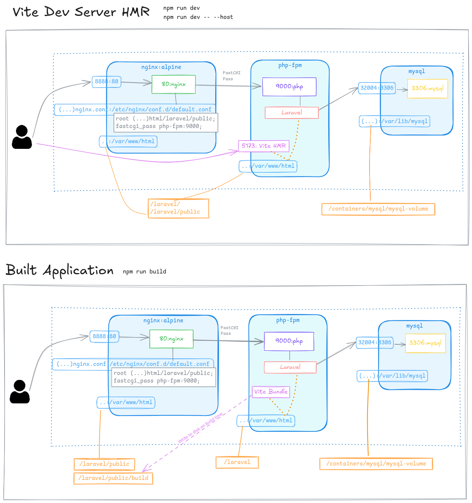

# Laravel Docker simple dev environment

Spin up a a dead simple laravel dev environment using docker.

## File Structure

```
📁 laravel
  - (your laravel app)
📁 docker
  📘 docker-compose.yml
  📄 .env
  📁 containers
    📁 nginx
    📁 php-fpm
    📁 mysql
```

You can edit your laravel files and the nignx/php config files
from your host machine.

The mysql data is also persisted to the host machine via a volume.

## Usage

1. Download this repo, or clone it and delete `.git` directory

2. Edit `docker/docker-compose.yml`:
	
	- `name: 'myapp'`
	- services ports, mysql service settings

3. Run/create containers: 
	
	cd docker
	docker compose up

### Install new Laravel instance

	# In php-fpm container:
	docker exec -it <your-app-name>-fpm-1 bash	
	# Or
	docker debug <your-app-name>-fpm-1
	
	cd /var/www/html
	laravel new laravel
	# If "laravel" command not in path:
	/root/.composer/vendor/laravel/installer/bin/laravel new laravel
	
	# If needed:
	cd laravel
	npm install && npm run build
	composer run dev

if you change the new 'laravel' by another name, you should also change it in: 
	- /docker/containers/nginx/nginx.conf
	- /.gitignore

#### File permissions

	chown 1000:1000 * -R # Parece no ser necesario
	chmod 777 storage -R
	
	# If using sqlite:
	chmod 777 database/database.sqlite 

### Env vars

Fix 419 on posts:
	
	SESSION_DRIVER=file

Optional. Other related in "config/session.php"
	'same_site' => env('SESSION_SAME_SITE', null)
	'http_only' => env('SESSION_HTTP_ONLY', false)
	'secure' => env('SESSION_SECURE_COOKIE', false)


#### Database

Use mysql container:

	#DB_CONNECTION=sqlite
	DB_CONNECTION=mysql
	DB_HOST=lar-simp-dok-mysql-1
	DB_PORT=3306
	DB_DATABASE=myapp_db
	DB_USERNAME=root
	DB_PASSWORD=myapp_mysql_root_pass

Migrate:

	php artisan:migrate

## Refresh laravel configs

	php artisan optimize:clear
	php artisan optimize
	npm run build

## Reload nginx container config

	nginx -t
	nginx -s reload

# Containers diagrams

The containers, ports, volumes and how they interact in these two scenarios:
- With the Vite development server for Hot Module Reloading (`npm run dev` or `npm run dev -- --host`)
- With the built application for production or testing (`npm run build`)

